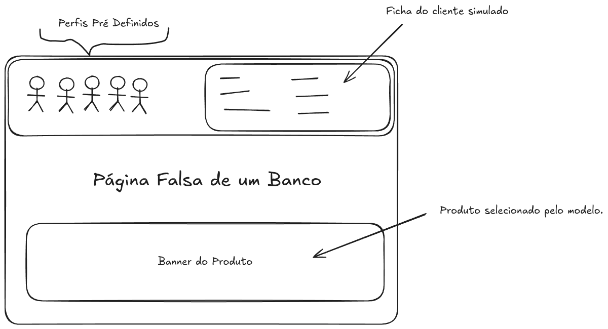
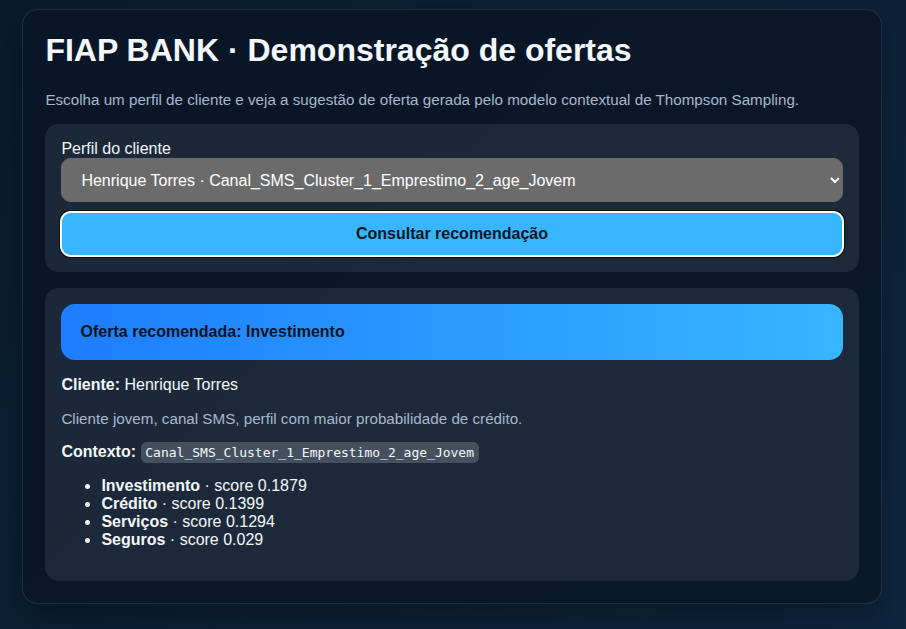
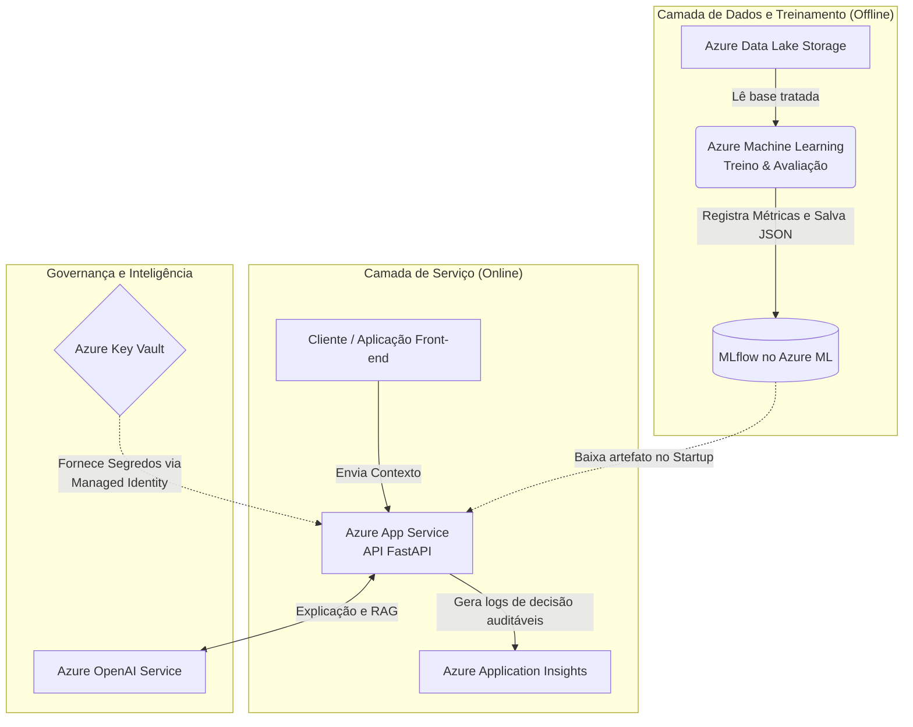

# Datathon 7MLET Grupo-10
FIAP Fase 5

Considerações importantes para o projeto.
- Ele foi iniciado ainda com versão original do datathon, então pode ter coisas que fazem referência a versão inicial ainda não simplificada do projeto.
- O projeto foi inicialmente nomeado como `special-octo-eureka` pelo GitHub, então algumas referèncias a esse nome também podem aparecer pelos commits e arquivos.

A ideia inicial do projeto é conseguir entregar uma pequena aplicação html que demonstre a predição e seleção de um oferta de produto financeiro.

## Etapa 0 — Organização do projeto

Todo o projeto roda basicamente com pyton como dependência, tanto para as APIs quando
aos notebooks usados para treinamento.

Mas também é utilizado o docker para poder rodar e demostrar o uso localmente.

**Versão minima do python 3.10**

**Utilizar docker e docker compose na V2**

### Crie o ambiente virtual
`python -m venv .venv`

### Instale as dependências
`.venv/bin/pip install .`

## Etapa 1 — Base Kaggle e EDA

### A base kaggle utilizada para o projeto foi a:

***[bank-marketing - henriqueyamahata](https://www.kaggle.com/code/henriqueyamahata/bank-marketing-classification-roc-f1-recall)***

Que é uma das bases sugeridas na descrição do Datathon.
Era uma base convencional e como uma quantidade honesta de dados que poderiamos adapatar para
outras realidades.

### Versão
12 de 12

### Licença
Este notebook foi disponibilizado sob a licença de código aberto Apache 2.0.

## Etapa 2 — Preparação da Base

### Raw database

Os dados originais são encontrados em: [`data/kaggle/raw/bank-additional-full.csv`](data/kaggle/raw/bank-additional-full.csv)

O notebook onde ocorre toda a exploração, limpeza, transformação dos dados é o: [`data/kaggle/notebooks/aed-banco.ipynb`](data/kaggle/notebooks/aed-banco.ipynb)

O arquivo que vai servir como a base dados para a geração de dados sintéticos é o: [`data/processed/bank-processed-v1-apache2.csv`](data/processed/bank-processed-v1-apache2.csv)

#### Cluster de Contexto
"Os segmentos de contexto não foram criados por regras manuais, mas sim utilizando o algoritmo K-Means sobre as variáveis X e Y. Encontramos K personas principais que foram mapeadas para a coluna context_segment."

#### Vinculo de entidades
Vínculo de Entidades (Entity Linkage): > Como a base original do Kaggle não possui um identificador de usuário , optamos por criar uma Chave Artificial chamada profile_id durante a Etapa 1. 
Cada profile_id mapeia diretamente para uma linha de atributos demográficos e financeiros na base data/processed/. 

### Dicionário de dados:

####  Dados do Cliente:

| Campo | Descrição | Tipo / Valores |
|---|---|---|
| age | Idade do cliente | numérico |
| job | Tipo de emprego | categórico: 'admin.', 'blue-collar', 'entrepreneur', 'housemaid', 'management', 'retired', 'self-employed', 'services', 'student', 'technician', 'unemployed', 'unknown' |
| marital | Estado Civil | categórico: 'divorced', 'married', 'single', 'unknown' (note: 'divorced' significa divorciado ou viúvo) |
| education | Educação | categórico: 'basic.4y', 'basic.6y', 'basic.9y', 'high.school', 'illiterate', 'professional.course', 'university.degree', 'unknown' |
| default | Possui crédito em inadimplência? | categórico: 'no', 'yes', 'unknown' |
| housing | Possui empréstimo habitacional? | categórico: 'no', 'yes', 'unknown' |
| loan | Possui empréstimo pessoal? | categórico: 'no', 'yes', 'unknown' |

####  Dados do último contato:

| Campo | Descrição | Tipo / Valores |
|---|---|---|
| Month | Mês do último contato | categórico: 'jan', 'feb', 'mar', ..., 'nov', 'dec' |
| Day_of_week | Dia da semana do último contato | categórico: 'mon', 'tue', 'wed', 'thu', 'fri' |

####  Dados socioeconômicos

| Campo | Descrição | Tipo |
|---|---|---|
| Emp.var.rate | Taxa de variação do emprego | Trimestral, numérico |
| Cons.price.idx | Índice de preços ao consumidor | Mensal, numérico |
| Cons.conf.idx | Índice de confiança do consumidor | Mensal, numérico |
| Euribor3m | Taxa Euribor de 3 meses | Diário, numérico |
| Nr.employed | Número de empregados | Trimestral, numérico |
| cluster | Rótulo de cluster do KMeans aplicado às características pessoais | categórico |

####  Variavel de saída (alvo):

| Campo | Descrição | Tipo / Valores |
|---|---|---|
| y | Cliente aderiu ao depósito a prazo? | binário: 'yes', 'no' |

## Etapa 3 — Baseline e estratégia algorítmica

Antes de definir um baseline foi necessário gerar a massa de dados final.
Como foram solicitada diferentes ofertas e a base original do Kaggle continha somente o um sim/não de uma unica proposta
foi criado então um catalogo simulado de ofertas.

***[offer_catelog.csv](data/synthetic_enrichment/offer_catalog.csv)***

Utilizano o notebook [data-generation.ipynb](data/synthetic_enrichment/data-generation.ipynb) foi gerado 
também uma seleção de eventos de aceite dessas ofertas com uma distribuição randomizada.

Gerando o arquivo:
***[offer_events.csv](data/synthetic_enrichment/offer_events.csv)***

### Partindo para o baseline e o modelo.

Somente após a criação dos arquivos de dados é que começamos a calcular o baseline
e explorar o aprendizado do moddelo.

***[model-basaeline.ipynb](data/model/model-baseline.ipynb)***

## Etapa 4 — Avaliação e Casos de Teste

Na avaliação e casos de testes passei por muitas situações até chegar em uma algoritiomos e dados que gerassem o efeito esperado.

No notebook ***[model-basaeline.ipynb](data/model/model-baseline.ipynb)*** é possível encontrar os comentários descrevendo os cenários mas aqui
temos também uma lista dos destaques.

Os eventos registrados em offer_events.csv utilizam essa chave para permitir que o algoritmo contextual recupere os atributos (features) do cliente no momento da tomada de decisão da oferta.

#### Overfitting no "Replay" (Testar sempre a mesma base)
Se estás a correr o teu script várias vezes em cima da mesma base de dados do Kaggle, estás a cometer um erro de Data Leakage temporal. O algoritmo lê o mesmo cliente que já tinha lido ontem e adiciona mais uma punição (
β) à mesma oferta. Isso esmaga a probabilidade de conversão geral.

Percebi que testar a mesma base muitas vezes em sequência acaba apagando a chance dela se ajustas corretamente.
Usei uma estratégia para multiplicar a base de dados replicando varias vezes os mesmo dados, para que o modelo tenha tempo de aprender.

"A arquitetura do  Bandit prevê a utilização de um Decay Factor para lidar com Concept Drift em produção. 
No entanto, durante a Avaliação Offline (Etapa 4), ao aplicarmos Data Augmentation para alongar o horizonte temporal, observamos que o fator de esquecimento causava amnésia no modelo em fases finais da simulação, degradando a performance.
Portanto, o hiperparâmetro de decay foi desativado (setado para 1.0) para os testes estáticos offline, mas permanece na codebase para ativação no ambiente produtivo de MLOps (Etapa 7)."

Também tive que testar muitas vezes com diferentes grupos de contexto e abordagens de aprendizado, pois o alogoritimo nunca conseguia aprender e ultrapassar o baseline gerado.

No final, consegui ajustas os grupos de contextos e encontrar um equilibrio entre os dados socioeconicos, divida e perfil dos clientes que geravam um aprendizado que ultrapassava o baseline.
Gerando provas do baseline e também separando a analise em fases de exploração explotação dos dados.

A Prova do Trade-off (Regret): Na primeira metade da simulação, o seu modelo teve uma conversão de 11.67%, perdendo para o Baseline (11.78%).
A Prova do Aprendizado (Explotação): Na segunda metade, depois que o modelo entendeu que o contexto X preferia a categoria Y, a conversão saltou para 11.97%, ultrapassando o "vidente" do Baseline e garantindo um Uplift real de +1.58%.

## Etapa 5 — Serviço ou interface demonstrável

Foi criado no diretório `app/frontend` uma simulação simples com uma tela simulando os perfis e gerando o retorno com a oferta escolhida.

Para o `app/backend` temos uma API simples usando o FastAPI e carregando localmente a run mais recente gerada com MlFlow (Não é o comum, mas foi mais fácil do que fazer um server como MLFlow)

## Etapa 6 - Arquitetura na Nuvem.

#### 1. Dados e Treinamento do Modelo (Como o modelo aprende na nuvem)
- **Armazenamento de Dados (Camada de Dados)** : 
    - Azure Data Lake Storage Gen2 (ou Azure Blob Storage). É aqui que é feito o upload da base limpa do Kaggle (data/processed). É um serviço muito barato para armazenar arquivos CSV estáticos.  
- **Treinamento e MLOps (Camada de Compute e MLOps)**: 
    - Azure Machine Learning (Azure ML). 
    - Por que usar: O Azure ML oferece "Compute Instances" (máquinas virtuais já configuradas com Jupyter) para rodar o código de treinamento.
    - A grande vantagem: O Azure ML tem integração nativa com o MLflow. Quando o código rodar lá, o arquivo thompson_sampling.json será salvo automaticamente no registro de modelos do Azure, e ficando sempre disponível.  

#### 2. Disponibilizando a API (Como o modelo toma decisões)
- **Hospedagem da API (Camada de API)** : 
    - Azure App Service (Web App).
    - Como funciona: Você simplesmente pega o código da sua FastAPI e faz o deploy no App Service.No evento de "startup" da API, ela vai se conectar ao Azure ML, fazer o download do último estado_thompson_sampling.json validado, carregar na memória RAM e ficar pronta para responder aos chamados em milissegundos.

#### 3. Segurança, IA e Observabilidade
- **Segurança e Identidade** : 
    - Habilitar Managed Identity no App Service: Isso dá uma "identidade" à API. Configurar o Azure Key Vault para guardar qualquer segredo e permite que apenas essa Managed Identity leia de lá.  
    - IA e RAG: Para o assistente LLM que explica as decisões, como solução podemos utilizar o  Azure OpenAI Service.
    - Observabilidade: Para capturar "logs auditáveis" (reason codes, braço escolhido) que a FastAPI gera, podemos usar como soluçãoo  Azure Monitor / Application Insights. O App Service envia os logs de inferência para lá automaticamente.

### Diagrama de exemplo da infraestrutura.

## Etapa 7 — Ciclo de vida MLOps

Fica aqui a dica de que na descrição do projeto o MLOps e o uso do MLFlow poderia ser indicado ali no começo.

Dessa forma mesmo as runs aonde eu não consegui atingir o baseline ou fui descobrindo as situações com problemas ficariam  registradas, não somente no notebook e commits mas como varias `runs` no experimento.

Mais para o final dos testes eu atualizei o ***[model-basaeline.ipynb](data/model/model-baseline.ipynb)*** para criar o experimento `Datathon_Experimentacao_Adaptativa` para registrar os dados do treinamento utilzando o MlFlow localmente.

Se der tempo, vou tentar transforma o MfFlow local em um serviço HTTP e incluir no docker compose utilizado na demonstração.

## Etapa 8 — Apresentação Final (Demo Day)

- Link do Video       -> http://yotube.com/video 
- Link do Repositório -> https://github.com/Getinstance/datathon-7mlet-grupo-10