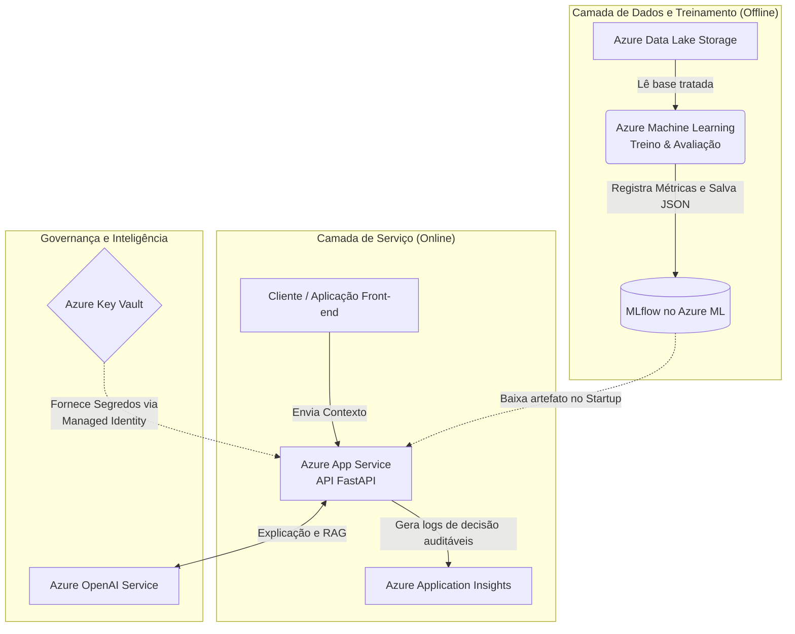

# Datathon 7MLET Grupo-10
FIAP Fase 5

Considerações importantes para o projeto.
- Ele foi iniciado ainda com versão original do datathon, então pode ter coisas que fazem referência a versão inicial ainda não simplificada do projeto.
- O projeto foi inicialmente nomeado como `special-octo-eureka` pelo GitHub, então algumas referèncias a esse nome também podem aparecer pelos commits e arquivos.

A ideia inicial do projeto é conseguir entregar uma pequena aplicação html que demonstre a predição e seleção de um oferta de produto financeiro.

## Etapa 0 — Organização do projeto

Todo o projeto roda basicamente com pyton como dependência, tanto para as APIs quando
aos notebooks usados para treinamento.

Mas também é utilizado o docker para poder rodar e demostrar o uso localmente.

**Versão minima do python 3.10**

**Utilizar docker e docker compose na V2**

### Crie o ambiente virtual
`python -m venv .venv`

### Instale as dependências
`.venv/bin/pip install .`

## Etapa 1 — Base Kaggle e EDA

### A base kaggle utilizada para o projeto foi a:

***[bank-marketing - henriqueyamahata](https://www.kaggle.com/code/henriqueyamahata/bank-marketing-classification-roc-f1-recall)***

Que é uma das bases sugeridas na descrição do Datathon.
Era uma base convencional e como uma quantidade honesta de dados que poderiamos adapatar para
outras realidades.

### Versão
12 de 12

### Licença
Este notebook foi disponibilizado sob a licença de código aberto Apache 2.0.

## Etapa 2 — Preparação da Base

### Raw database

Os dados originais são encontrados em: [`data/kaggle/raw/bank-additional-full.csv`](data/kaggle/raw/bank-additional-full.csv)

O notebook onde ocorre toda a exploração, limpeza, transformação dos dados é o: [`data/kaggle/notebooks/aed-banco.ipynb`](data/kaggle/notebooks/aed-banco.ipynb)

O arquivo que vai servir como a base dados para a geração de dados sintéticos é o: [`data/processed/bank-processed-v1-apache2.csv`](data/processed/bank-processed-v1-apache2.csv)

### Dicionário de dados:

####  Dados do Cliente:

| Campo | Descrição | Tipo / Valores |
|---|---|---|
| age | Idade do cliente | numérico |
| job | Tipo de emprego | categórico: 'admin.', 'blue-collar', 'entrepreneur', 'housemaid', 'management', 'retired', 'self-employed', 'services', 'student', 'technician', 'unemployed', 'unknown' |
| marital | Estado Civil | categórico: 'divorced', 'married', 'single', 'unknown' (note: 'divorced' significa divorciado ou viúvo) |
| education | Educação | categórico: 'basic.4y', 'basic.6y', 'basic.9y', 'high.school', 'illiterate', 'professional.course', 'university.degree', 'unknown' |
| default | Possui crédito em inadimplência? | categórico: 'no', 'yes', 'unknown' |
| housing | Possui empréstimo habitacional? | categórico: 'no', 'yes', 'unknown' |
| loan | Possui empréstimo pessoal? | categórico: 'no', 'yes', 'unknown' |

####  Dados do último contato:

| Campo | Descrição | Tipo / Valores |
|---|---|---|
| Month | Mês do último contato | categórico: 'jan', 'feb', 'mar', ..., 'nov', 'dec' |
| Day_of_week | Dia da semana do último contato | categórico: 'mon', 'tue', 'wed', 'thu', 'fri' |

####  Dados socioeconômicos

| Campo | Descrição | Tipo |
|---|---|---|
| Emp.var.rate | Taxa de variação do emprego | Trimestral, numérico |
| Cons.price.idx | Índice de preços ao consumidor | Mensal, numérico |
| Cons.conf.idx | Índice de confiança do consumidor | Mensal, numérico |
| Euribor3m | Taxa Euribor de 3 meses | Diário, numérico |
| Nr.employed | Número de empregados | Trimestral, numérico |
| cluster | Rótulo de cluster do KMeans aplicado às características pessoais | categórico |

####  Variavel de saída (alvo):

| Campo | Descrição | Tipo / Valores |
|---|---|---|
| y | Cliente aderiu ao depósito a prazo? | binário: 'yes', 'no' |

## Etapa 3 — Baseline e estratégia algorítmica
## Etapa 4 — Avaliação e Casos de Teste
## Etapa 5 — Serviço ou interface demonstrável

## Etapa 6 - Arquitetura na Nuvem.

#### 1. Dados e Treinamento do Modelo (Como o modelo aprende na nuvem)
- **Armazenamento de Dados (Camada de Dados)** : 
    - Azure Data Lake Storage Gen2 (ou Azure Blob Storage). É aqui que é feito o upload da base limpa do Kaggle (data/processed). É um serviço muito barato para armazenar arquivos CSV estáticos.  
- **Treinamento e MLOps (Camada de Compute e MLOps)**: 
    - Azure Machine Learning (Azure ML). 
    - Por que usar: O Azure ML oferece "Compute Instances" (máquinas virtuais já configuradas com Jupyter) para rodar o código de treinamento.
    - A grande vantagem: O Azure ML tem integração nativa com o MLflow. Quando o código rodar lá, o arquivo thompson_sampling.json será salvo automaticamente no registro de modelos do Azure, e ficando sempre disponível.  

#### 2. Disponibilizando a API (Como o modelo toma decisões)
- **Hospedagem da API (Camada de API)** : 
    - Azure App Service (Web App).
    - Como funciona: Você simplesmente pega o código da sua FastAPI e faz o deploy no App Service.No evento de "startup" da API, ela vai se conectar ao Azure ML, fazer o download do último estado_thompson_sampling.json validado, carregar na memória RAM e ficar pronta para responder aos chamados em milissegundos.

#### 3. Segurança, IA e Observabilidade
- **Segurança e Identidade** : 
    - Habilitar Managed Identity no App Service: Isso dá uma "identidade" à API. Configurar o Azure Key Vault para guardar qualquer segredo e permite que apenas essa Managed Identity leia de lá.  
    - IA e RAG: Para o assistente LLM que explica as decisões, como solução podemos utilizar o  Azure OpenAI Service.
    - Observabilidade: Para capturar "logs auditáveis" (reason codes, braço escolhido) que a FastAPI gera, podemos usar como soluçãoo  Azure Monitor / Application Insights. O App Service envia os logs de inferência para lá automaticamente.

### Diagrama de exemplo da infraestrutura.

## Etapa 7 — Ciclo de vida MLOps